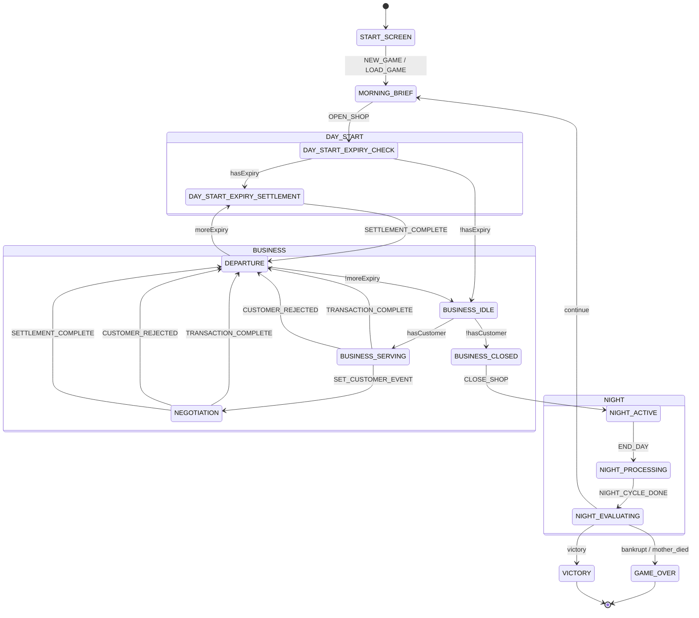

# 显式状态机架构

本文档描述《典当困境》游戏的显式状态机 (Explicit State Machine) 实现。

---

## 概述

游戏使用 Discriminated Union 类型定义状态，通过集中式转换规则表管理所有状态转换。这种模式的优势：

- **显式子状态**: 每个主状态可以有明确的子状态，消除隐式状态判断
- **类型安全**: TypeScript 编译器可以检查状态转换的正确性
- **集中管理**: 所有转换规则在一个文件中定义，便于理解和维护
- **可预测性**: 状态转换通过事件驱动，便于调试和测试

---

## 核心类型

### GamePhase

```typescript
// systems/core/phases/types.ts

type GamePhase =
    | { type: 'START_SCREEN' }
    | { type: 'MORNING_BRIEF' }
    | { type: 'DAY_START'; subphase: DayStartSubphase }
    | { type: 'BUSINESS'; subphase: BusinessSubphase }
    | { type: 'NEGOTIATION'; mode: NegotiationMode }
    | { type: 'DEPARTURE' }
    | { type: 'NIGHT'; subphase: NightSubphase }
    | { type: 'GAME_OVER'; reason: string }
    | { type: 'VICTORY' };
```

### 子状态类型

```typescript
type DayStartSubphase =
    | 'EXPIRY_CHECK'      // 检查今日到期物品
    | 'EXPIRY_SETTLEMENT'; // 处理到期结算

type BusinessSubphase =
    | 'IDLE'        // 等待顾客生成
    | 'GENERATING'  // 正在生成顾客
    | 'SERVING'     // 服务顾客中
    | 'CLOSED';     // 可以打烊

type NegotiationMode =
    | 'PAWN'         // 典当谈判
    | 'REDEEM'       // 赎回结算
    | 'RENEWAL'      // 续当请求
    | 'POST_FORFEIT'; // 绝当后回访

type NightSubphase =
    | 'ACTIVE'      // 夜间活动可用
    | 'PROCESSING'  // 执行夜间结算
    | 'EVALUATING'; // 评估游戏结局
```

### PhaseEvent

```typescript
type PhaseEvent =
    // 开始界面
    | { type: 'NEW_GAME' }
    | { type: 'LOAD_GAME' }

    // 晨间简报
    | { type: 'OPEN_SHOP' }

    // 日间开始
    | { type: 'EXPIRY_CHECK_DONE'; hasExpiry: boolean }
    | { type: 'SETTLEMENT_COMPLETE' }

    // 送客
    | { type: 'DISMISS' }

    // 营业
    | { type: 'CUSTOMER_GENERATED'; hasCustomer: boolean }
    | { type: 'SET_CUSTOMER_EVENT'; mode: NegotiationMode }
    | { type: 'TRANSACTION_COMPLETE' }
    | { type: 'CUSTOMER_REJECTED' }
    | { type: 'CLOSE_SHOP' }

    // 夜间
    | { type: 'END_DAY' }
    | { type: 'NIGHT_CYCLE_DONE' }
    | { type: 'EVALUATION_DONE'; outcome: EvaluationOutcome };
```

---

## 状态转换规则

转换规则定义在 `systems/core/phases/transitions.ts` 中。每条规则包含：

```typescript
type TransitionRule = {
    from: (phase: GamePhase) => boolean;  // 匹配源状态
    event: PhaseEvent['type'];             // 触发事件
    guard?: (state, event) => boolean;     // 守卫条件（可选）
    to: (state, event) => GamePhase;       // 目标状态
    effects?: Array<(state, event) => Partial<GameState>>; // 副作用（可选）
};
```

### 完整转换规则表

```
┌──────────────────────────────────┬────────────────────────┬─────────────────────┬──────────────────────────────────┐
│ 源状态                           │ 事件                   │ 守卫条件            │ 目标状态                         │
├──────────────────────────────────┼────────────────────────┼─────────────────────┼──────────────────────────────────┤
│ START_SCREEN                     │ NEW_GAME               │ -                   │ MORNING_BRIEF                    │
│ START_SCREEN                     │ LOAD_GAME              │ -                   │ MORNING_BRIEF                    │
├──────────────────────────────────┼────────────────────────┼─────────────────────┼──────────────────────────────────┤
│ MORNING_BRIEF                    │ OPEN_SHOP              │ -                   │ DAY_START.EXPIRY_CHECK           │
├──────────────────────────────────┼────────────────────────┼─────────────────────┼──────────────────────────────────┤
│ DAY_START.EXPIRY_CHECK           │ EXPIRY_CHECK_DONE      │ hasExpiry=true      │ DAY_START.EXPIRY_SETTLEMENT      │
│ DAY_START.EXPIRY_CHECK           │ EXPIRY_CHECK_DONE      │ hasExpiry=false     │ BUSINESS.IDLE                    │
├──────────────────────────────────┼────────────────────────┼─────────────────────┼──────────────────────────────────┤
│ DAY_START.EXPIRY_SETTLEMENT      │ SETTLEMENT_COMPLETE    │ -                   │ DEPARTURE                        │
├──────────────────────────────────┼────────────────────────┼─────────────────────┼──────────────────────────────────┤
│ DEPARTURE                        │ DISMISS                │ expiryQueue > 1     │ DAY_START.EXPIRY_SETTLEMENT      │
│ DEPARTURE                        │ DISMISS                │ expiryQueue <= 1    │ BUSINESS.IDLE                    │
├──────────────────────────────────┼────────────────────────┼─────────────────────┼──────────────────────────────────┤
│ BUSINESS.IDLE                    │ CUSTOMER_GENERATED     │ hasCustomer=true    │ BUSINESS.SERVING                 │
│ BUSINESS.IDLE                    │ CUSTOMER_GENERATED     │ hasCustomer=false   │ BUSINESS.CLOSED                  │
├──────────────────────────────────┼────────────────────────┼─────────────────────┼──────────────────────────────────┤
│ BUSINESS.SERVING                 │ SET_CUSTOMER_EVENT     │ -                   │ NEGOTIATION (mode from event)    │
│ BUSINESS.SERVING                 │ TRANSACTION_COMPLETE   │ -                   │ DEPARTURE                        │
│ BUSINESS.SERVING                 │ CUSTOMER_REJECTED      │ -                   │ DEPARTURE                        │
├──────────────────────────────────┼────────────────────────┼─────────────────────┼──────────────────────────────────┤
│ NEGOTIATION (all modes)          │ TRANSACTION_COMPLETE   │ -                   │ DEPARTURE                        │
│ NEGOTIATION (all modes)          │ CUSTOMER_REJECTED      │ -                   │ DEPARTURE                        │
│ NEGOTIATION (all modes)          │ SETTLEMENT_COMPLETE    │ -                   │ DEPARTURE                        │
├──────────────────────────────────┼────────────────────────┼─────────────────────┼──────────────────────────────────┤
│ BUSINESS.CLOSED                  │ CLOSE_SHOP             │ -                   │ NIGHT.ACTIVE                     │
├──────────────────────────────────┼────────────────────────┼─────────────────────┼──────────────────────────────────┤
│ NIGHT.ACTIVE                     │ END_DAY                │ -                   │ NIGHT.PROCESSING                 │
├──────────────────────────────────┼────────────────────────┼─────────────────────┼──────────────────────────────────┤
│ NIGHT.PROCESSING                 │ NIGHT_CYCLE_DONE       │ -                   │ NIGHT.EVALUATING                 │
├──────────────────────────────────┼────────────────────────┼─────────────────────┼──────────────────────────────────┤
│ NIGHT.EVALUATING                 │ EVALUATION_DONE        │ outcome=continue    │ MORNING_BRIEF                    │
│ NIGHT.EVALUATING                 │ EVALUATION_DONE        │ outcome=bankrupt    │ GAME_OVER (破产)                 │
│ NIGHT.EVALUATING                 │ EVALUATION_DONE        │ outcome=mother_died │ GAME_OVER (母亲去世)             │
│ NIGHT.EVALUATING                 │ EVALUATION_DONE        │ outcome=victory     │ VICTORY                          │
└──────────────────────────────────┴────────────────────────┴─────────────────────┴──────────────────────────────────┘
```

---

## 状态机可视化

### Mermaid 图



---

## 使用指南

### useGameMachine Hook

组件通过 `useGameMachine` hook 与状态机交互：

```typescript
import { useGameMachine } from '@/hooks/useGameMachine';

function MyComponent() {
    const { phase, context, send, can, availableEvents } = useGameMachine();

    // phase: 当前状态（GamePhase 类型）
    // context: 完整游戏状态
    // send: 发送事件函数
    // can: 检查事件是否可发送
    // availableEvents: 获取当前可用事件列表
}
```

### 示例: 检查当前状态

```typescript
import { useGameMachine, PhaseIs, PhaseMatch } from '@/hooks/useGameMachine';

function GameView() {
    const { phase } = useGameMachine();

    // 方式 1: 使用类型守卫（推荐，类型安全）
    if (PhaseIs.business(phase)) {
        // TypeScript 知道 phase 有 subphase 属性
        console.log('当前子状态:', phase.subphase);
    }

    // 方式 2: 使用复合检查
    if (PhaseMatch.businessClosed(phase)) {
        return <CloseShopButton />;
    }

    // 方式 3: 直接检查 type（简单情况）
    if (phase.type === 'MORNING_BRIEF') {
        return <MorningBrief />;
    }
}
```

### 示例: 发送事件

```typescript
function NightDashboard() {
    const { send, can } = useGameMachine();

    const handleEndDay = () => {
        // 检查是否可以发送事件
        if (can({ type: 'END_DAY' })) {
            send({ type: 'END_DAY' });
        }
    };

    return <button onClick={handleEndDay}>结束今天</button>;
}
```

### 示例: 条件渲染

```typescript
function App() {
    const { phase, PhaseIs, PhaseMatch } = useGameMachine();

    return (
        <>
            {PhaseIs.startScreen(phase) && <StartScreen />}
            {PhaseIs.morningBrief(phase) && <MorningBrief />}

            {PhaseMatch.dayStartExpiry(phase) && <SettlementInterface />}

            {PhaseMatch.businessIdle(phase) && <LoadingSpinner />}
            {PhaseMatch.businessServing(phase) && <NegotiationPanel />}
            {PhaseMatch.businessClosed(phase) && <ShopClosedView />}

            {PhaseIs.departure(phase) && <DepartureView />}

            {PhaseIs.night(phase) && <NightDashboard />}

            {PhaseIs.gameOver(phase) && <GameOverScreen reason={phase.reason} />}
            {PhaseIs.victory(phase) && <VictoryScreen />}
        </>
    );
}
```

---

## 类型守卫

### PhaseIs

用于检查主状态类型，返回类型谓词以缩小类型：

```typescript
const PhaseIs = {
    startScreen:  (p: GamePhase): p is { type: 'START_SCREEN' },
    morningBrief: (p: GamePhase): p is { type: 'MORNING_BRIEF' },
    dayStart:     (p: GamePhase): p is { type: 'DAY_START'; subphase: DayStartSubphase },
    business:     (p: GamePhase): p is { type: 'BUSINESS'; subphase: BusinessSubphase },
    negotiation:  (p: GamePhase): p is { type: 'NEGOTIATION'; mode: NegotiationMode },
    departure:    (p: GamePhase): p is { type: 'DEPARTURE' },
    night:        (p: GamePhase): p is { type: 'NIGHT'; subphase: NightSubphase },
    gameOver:     (p: GamePhase): p is { type: 'GAME_OVER'; reason: string },
    victory:      (p: GamePhase): p is { type: 'VICTORY' },
};
```

**使用:**

```typescript
if (PhaseIs.business(phase)) {
    // TypeScript 知道 phase.subphase 存在
    console.log(phase.subphase); // 'IDLE' | 'GENERATING' | 'SERVING' | 'CLOSED'
}
```

### PhaseMatch

用于检查状态+子状态的组合，返回 boolean：

```typescript
const PhaseMatch = {
    // DAY_START
    dayStartExpiry: (p) => PhaseIs.dayStart(p) && p.subphase === 'EXPIRY_SETTLEMENT',

    // BUSINESS
    businessIdle:       (p) => PhaseIs.business(p) && p.subphase === 'IDLE',
    businessGenerating: (p) => PhaseIs.business(p) && p.subphase === 'GENERATING',
    businessServing:    (p) => PhaseIs.business(p) && p.subphase === 'SERVING',
    businessClosed:     (p) => PhaseIs.business(p) && p.subphase === 'CLOSED',

    // NIGHT
    nightActive:     (p) => PhaseIs.night(p) && p.subphase === 'ACTIVE',
    nightProcessing: (p) => PhaseIs.night(p) && p.subphase === 'PROCESSING',
    nightEvaluating: (p) => PhaseIs.night(p) && p.subphase === 'EVALUATING',
};
```

---

## 状态机核心函数

文件位置: `systems/core/phases/machine.ts`

### transition()

执行状态转换，返回新状态和状态更新：

```typescript
function transition(
    phase: GamePhase,
    event: PhaseEvent,
    state: GameState
): { nextPhase: GamePhase; stateUpdates: Partial<GameState> } | null;
```

### canTransition()

检查转换是否有效：

```typescript
function canTransition(
    phase: GamePhase,
    event: PhaseEvent,
    state: GameState
): boolean;
```

### getAvailableEvents()

获取当前状态可用的事件类型：

```typescript
function getAvailableEvents(
    phase: GamePhase,
    state: GameState
): PhaseEvent['type'][];
```

---

## 添加新转换

在 `systems/core/phases/transitions.ts` 中添加新规则：

```typescript
// 1. 添加转换规则
export const TRANSITIONS: TransitionRule[] = [
    // ... 现有规则 ...

    // 新规则示例
    {
        from: (p) => p.type === 'SOME_STATE' && p.subphase === 'SOME_SUBPHASE',
        event: 'SOME_EVENT',
        guard: (state) => state.someCondition,  // 可选
        to: () => ({ type: 'TARGET_STATE', subphase: 'TARGET_SUBPHASE' }),
        effects: [actions.someEffect]  // 可选
    },
];
```

如果需要新的事件类型，在 `types.ts` 中添加：

```typescript
export type PhaseEvent =
    // ... 现有事件 ...
    | { type: 'SOME_EVENT'; payload?: SomePayload };
```

---

## 调试

### 开发环境日志

开发环境下，状态机会自动输出转换日志：

```
[StateMachine] {"type":"BUSINESS","subphase":"IDLE"} --[CUSTOMER_GENERATED]--> {"type":"BUSINESS","subphase":"SERVING"}
```

### DevConsole 命令

使用 DevConsole 查看和操作状态：

```
state                    # 查看当前状态
set phase NIGHT.ACTIVE   # 设置状态
```

---

## 文件结构

```
systems/core/phases/
├── index.ts        # 统一导出
├── types.ts        # 类型定义 (GamePhase, PhaseEvent, 子状态类型)
├── guards.ts       # 类型守卫 (PhaseIs, PhaseMatch)
├── machine.ts      # 核心函数 (transition, canTransition, getAvailableEvents)
├── transitions.ts  # 转换规则表
└── actions.ts      # 转换副作用函数

hooks/
└── useGameMachine.ts  # React hook
```

---

## 迁移说明

此状态机是从旧的 `GamePhase` enum 迁移而来。旧的 enum 仍保留为 `LegacyGamePhase` 用于存档兼容。

迁移详情参见: `docs/pending-systems/STATE_MACHINE_MIGRATION_PLAN.md`

---

## 版本历史

- **2026-02-04**: 初始版本 - 状态机迁移完成
